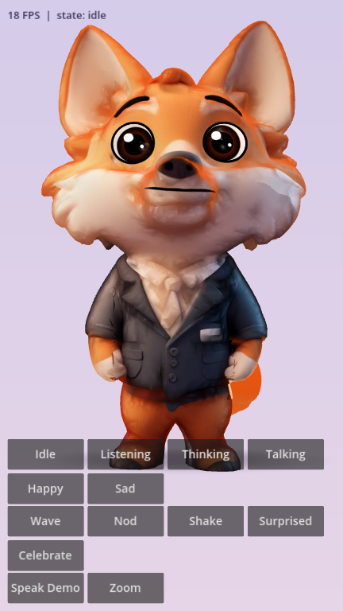

# Harvey — animated AI-assistant avatar (Godot 4.3, MIT)

A rigged, animated, expressive 3D fox avatar built from `source/fox_raw.glb` (image-to-3D scan) and
`source/fox_reference.jpg`, designed to run on low-end Android phones (target: Moto G Play).



## What you get
| Item | Path |
|---|---|
| Rigged + animated model (glTF 2.0, 30k tris, 26-bone `Skeleton3D`, 11 animations) | `godot/avatar/harvey.glb` |
| Clean-plate texture (face features removed, drawn by shader) | `godot/avatar/harvey_albedo.png` |
| Face/body shader (eyes, blink, gaze, brows, talking mouth, blush) | `godot/avatar/harvey_face.gdshader` |
| Drop-in avatar scene + API | `godot/avatar/harvey.tscn`, `godot/avatar/avatar.gd` |
| Procedural head look-at (`SkeletonModifier3D`) | `godot/avatar/head_look_modifier.gd` |
| Demo / test bench (touch UI) | `godot/demo/demo.tscn` |
| Android export preset (arm64, GLES3 Compatibility) | `godot/export_presets.cfg` |
| Reproducible build pipeline | `tools/build_avatar.py`, `tools/animations.py` |
| Verification renders (real Godot renderer) | `previews/*.png` |
| Build log for review | `docs/BUILD_LOG.md` |

## Using it in your assistant app
```gdscript
var harvey: HarveyAvatar = preload("res://avatar/harvey.tscn").instantiate()
add_child(harvey)

harvey.set_state("listening")        # idle | listening | thinking | talking | happy | sad
harvey.set_state("thinking")         # while your LLM call is in flight
harvey.speak(tts_audio_stream)       # TTS audio → automatic lip-sync, returns to idle when done
harvey.speak_text(reply_text, secs)  # if TTS is played by Android natively: procedural lip-sync
harvey.play_emote("wave")            # wave | nod | shake | surprised | celebrate
harvey.set_expression("joy")         # neutral listening thinking talking happy joy sad surprised ("" = auto)
harvey.look_at_point(world_pos)      # head + eyes track a point; harvey.clear_look()
harvey.external_lipsync = true; harvey.set_lipsync(open, wide)   # drive visemes yourself
```
Signals: `state_changed`, `emote_started`, `emote_finished`, `speech_started`, `speech_finished`.

## Run / export
1. Install **Godot 4.3** (MIT) and open `godot/project.godot`. Press Play → demo with buttons.
2. Android: Editor → Manage Export Templates → install 4.3 templates; set Android SDK + JDK 17 and a
   debug keystore in Editor Settings; Project → Export → "Android (Moto G Play)" → set your package
   name → Export APK. Renderer is GL Compatibility (GLES3), arm64 only, ETC2/ASTC textures.

## Mobile budget
30k triangles, 1 skinned mesh, 1 material, 1 draw call for the character, 512×768 texture,
no realtime shadows (blob shadow), no post-processing. Face features are analytic (no extra textures).

## Rebuild the asset
```
pip install trimesh fast-simplification scipy pillow numpy
python3 tools/build_avatar.py          # writes godot/avatar/harvey.glb + harvey_albedo.png
python3 tools/preview.py anim:wave:1.0 out.png   # quick CPU preview of any pose
godot --path godot --rendering-driver opengl3 --script res://tools/shots.gd -- ../previews   # real renders
```

## Licensing
All code/shaders/scenes here: MIT (see `LICENSE`). Runtime dependency: Godot Engine (MIT).
Build-only tools (not shipped): trimesh (MIT), fast-simplification (MIT), Pillow (MIT-CMU),
numpy/scipy (BSD-3, permissive). No GPL software used. **The character design itself comes from
your input image/mesh — make sure you hold the rights to that source art (e.g. the generator's
terms of service) before commercial use.**

## Known limitations (honest list)
- The source scan fused arms to the jacket. Parts are separated and holes capped, so big gestures
  (wave, celebrate) work, but up close you can see flat cap patches under raised arms.
- Back/side surfaces use rule-based flat colours (the reference image only shows the front), so
  the back is plainer than the front.
- Not yet profiled on a physical Moto G Play (no device here); the budget above is conservative
  for Adreno 610/619 and PowerVR GE8320. Verify with the FPS counter in the demo.
